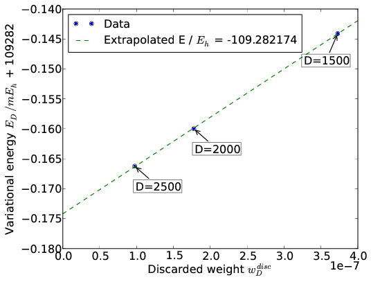

.. CheMPS2: a spin-adapted implementation of DMRG for ab initio quantum chemistry
   Copyright (C) 2013-2018 Sebastian Wouters

   This program is free software; you can redistribute it and/or modify
   it under the terms of the GNU General Public License as published by
   the Free Software Foundation; either version 2 of the License, or
   (at your option) any later version.

   This program is distributed in the hope that it will be useful,
   but WITHOUT ANY WARRANTY; without even the implied warranty of
   MERCHANTABILITY or FITNESS FOR A PARTICULAR PURPOSE.  See the
   GNU General Public License for more details.

   You should have received a copy of the GNU General Public License along
   with this program; if not, write to the Free Software Foundation, Inc.,
   51 Franklin Street, Fifth Floor, Boston, MA 02110-1301 USA.

.. index:: Input and output

DMRG calculations
=================

``CheMPS2::Problem``
--------------------

Once a ``CheMPS2::Hamiltonian`` object is created and filled with matrix elements, the desired symmetry sector should be specified in the ``CheMPS2::Problem`` object:

.. code-block:: c++

    CheMPS2::Problem::Problem( const CheMPS2::Hamiltonian * Hamin, const int TwoSin, const int Nin, const int Irrepin )

The variable ``Hamin`` contains the number of orbitals, the point group of the Hamiltonian, and the irrep of each orbital. The variable ``TwoSin`` should be :math:`2S`, twice the targeted spin value in the active space (multiplicity minus one). The variable ``Nin`` should be the number of electrons in the active space. The variable ``Irrepin`` should be the targeted irrep in the active space, defined according to the numbering conventions in `psi4 <http://www.psicode.org/>`_. The section :ref:`chemps2_psi4irrepconventions` lists these conventions.

.. _chemps2_convergencescheme_object:

``CheMPS2::ConvergenceScheme``
------------------------------

The ``CheMPS2::Problem`` defines a FCI problem. In order to perform DMRG calculations, a ``CheMPS2::ConvergenceScheme`` should be provided as well. A convergence scheme consists of consecutive instructions, which are executed in order. Each instruction specifies five quantities:

#. The number of reduced virtual basis states :math:`D_{\mathsf{SU(2)}}` to be retained.
#. The energy convergence threshold :math:`E_{conv}` to stop the instruction.
#. The maximum number of sweeps :math:`N_{max}` for that instruction.
#. The noise prefactor :math:`\gamma_{noise}`, which defines the magnitude of the noise added to the tensor :math:`\mathbf{B}[i]` prior to singular value decomposition. The noise is bounded in magnitude by :math:`0.5 \gamma_{\text{noise}} w_D^{disc}`, where :math:`w_D^{disc} = \max\limits_{i}\left( w_D[i] \right)`, the maximum discarded weight of the previous sweep.
#. The residual norm tolerance for the Davidson algorithm, which is used to solve the effective Hamiltonian eigenvalue equations.

A typical example of a convergence scheme is:

 +----------------------------+------------------+-----------------+------------------------+-----------------+
 | :math:`D_{\mathsf{SU(2)}}` | :math:`E_{conv}` | :math:`N_{max}` | :math:`\gamma_{noise}` | :math:`r_{tol}` |
 +============================+==================+=================+========================+=================+
 | 500                        | 1e-8             | 10              | 0.05                   | 1e-5            |
 +----------------------------+------------------+-----------------+------------------------+-----------------+
 | 1000                       | 1e-8             | 10              | 0.05                   | 1e-5            |
 +----------------------------+------------------+-----------------+------------------------+-----------------+
 | 1500                       | 1e-8             | 10              | 0.05                   | 1e-5            |
 +----------------------------+------------------+-----------------+------------------------+-----------------+
 | 2000                       | 1e-8             | 10              | 0.05                   | 1e-5            |
 +----------------------------+------------------+-----------------+------------------------+-----------------+
 | 2500                       | 1e-8             | 10              | 0.05                   | 1e-5            |
 +----------------------------+------------------+-----------------+------------------------+-----------------+
 | 2500                       | 1e-8             | 10              | 0.0                    | 1e-8            |
 +----------------------------+------------------+-----------------+------------------------+-----------------+
 | 2000                       | 1e-8             | 10              | 0.0                    | 1e-8            |
 +----------------------------+------------------+-----------------+------------------------+-----------------+
 | 1500                       | 1e-8             | 10              | 0.0                    | 1e-8            |
 +----------------------------+------------------+-----------------+------------------------+-----------------+

At first, the number of retained reduced virtual basis states is increased in each instruction, while noise is added to the wavefunction prior to decomposition. Afterwards, instructions without noise are performed and the number of retained reduced virtual basis states is decreased. The instructions with decreasing :math:`D_{\mathsf{SU(2)}}` are used to extrapolate the variational DMRG energies with discarded weight (see section :ref:`chemps2_extrapolation`).

The API for the ``CheMPS2::ConvergenceScheme`` class:

.. code-block:: c++

    CheMPS2::ConvergenceScheme::ConvergenceScheme( const int nInstructions )
    void CheMPS2::ConvergenceScheme::set_instruction( const int instruction, const int D, const double energy_conv, const int max_sweeps, const double noise_prefactor, const double davidson_rtol )
    
The variable ``D`` is the number of reduced virtual basis states :math:`D_{\mathsf{SU(2)}}`!

.. _chemps2_dmrg_object:

``CheMPS2::DMRG``
-----------------

With the ``CheMPS2::Problem`` and ``CheMPS2::ConvergenceScheme`` objects, DMRG calculations are completely defined:

.. code-block:: c++

    CheMPS2::DMRG::DMRG( CheMPS2::Problem * Probin, CheMPS2::ConvergenceScheme * OptSchemeIn, const bool makechkpt, const string tmpfolder )
    double CheMPS2::DMRG::Solve()

If the variable ``makechkpt`` is ``true``, MPS checkpoints of the form ``CheMPS2_MPS*.h5`` are generated in the execution folder. They are stored/overwritten each time a full left and right sweep has been performed. The checkpoints allow to restart calculations. It is the responsibility of the user to remove the completed instructions from the ``CheMPS2::ConvergenceScheme`` before restarting a calculation!

The function ``CheMPS2::DMRG::Solve()`` performs the instructions and returns the minimal encountered energy during all sweeps (which is variational). It is possible to extrapolate the variational energies obtained with different :math:`D_{\mathsf{SU(2)}}` to :math:`D_{\mathsf{SU(2)}} = \infty`. This is explained in the section :ref:`chemps2_extrapolation`.

In addition to the energy, the 2-RDM and 3-RDM of the active space can also be obtained, as well as several correlation functions. Thereto, the following functions should be used:

.. code-block:: c++

    void CheMPS2::DMRG::calc_rdms_and_correlations( const bool do_3rdm, const bool disk_3rdm )
    CheMPS2::TwoDM * CheMPS2::DMRG::get2DM()
    CheMPS2::ThreeDM * CheMPS2::DMRG::get3DM()
    CheMPS2::Correlations * CheMPS2::DMRG::getCorrelations()
    double CheMPS2::TwoDM::getTwoDMA_HAM( const int cnt1, const int cnt2, const int cnt3, const int cnt4 ) const
    double CheMPS2::TwoDM::getTwoDMB_HAM( const int cnt1, const int cnt2, const int cnt3, const int cnt4 ) const
    double CheMPS2::ThreeDM::get_ham_index( const int cnt1, const int cnt2, const int cnt3, const int cnt4, const int cnt5, const int cnt6 ) const
    double CheMPS2::Correlations::getCspin_HAM( const int row, const int col ) const
    double CheMPS2::Correlations::getCdens_HAM( const int row, const int col ) const 
    double CheMPS2::Correlations::getCspinflip_HAM( const int row, const int col ) const 
    double CheMPS2::Correlations::getCdirad_HAM( const int row, const int col ) const 
    double CheMPS2::Correlations::getMutualInformation_HAM( const int row, const int col ) const
    void CheMPS2::Correlations::Print( const int precision=6, const int columnsPerLine=8 ) const 
    
The 2-RDM and 3-RDM are again represented in physics notation. As CheMPS2 is a spin-adapted code, only spin-summed quantities can be obtained as output:

.. math::

    \Gamma^A_{ij;kl} & = & \sum_{\sigma \tau} \left\langle \hat{a}^{\dagger}_{i \sigma} \hat{a}^{\dagger}_{j \tau} \hat{a}_{l \tau} \hat{a}_{k \sigma} \right\rangle \\
    \Gamma^B_{ij;kl} & = & \sum_{\sigma} \left( \left\langle \hat{a}^{\dagger}_{i \sigma} \hat{a}^{\dagger}_{j \sigma} \hat{a}_{l \sigma} \hat{a}_{k \sigma} \right\rangle - \left\langle \hat{a}^{\dagger}_{i \sigma} \hat{a}^{\dagger}_{j -\sigma} \hat{a}_{l -\sigma} \hat{a}_{k \sigma} \right\rangle  \right) \\
    \Gamma_{ijk;lmn} & = & \sum_{\sigma \tau z} \left\langle \hat{a}^{\dagger}_{i \sigma} \hat{a}^{\dagger}_{j \tau} \hat{a}^{\dagger}_{k z} \hat{a}_{n z } \hat{a}_{m \tau} \hat{a}_{l \sigma} \right\rangle

The correlation functions are defined as:

.. math::

    C_{spin}(i,j) & = & 4 \left( \left\langle \hat{S}_i^z \hat{S}_j^z \right\rangle - \left\langle \hat{S}_i^z \right\rangle \left\langle \hat{S}_j^z \right\rangle \right)\\
    C_{spinflip}(i,j) & = & \left\langle \hat{S}_i^+ \hat{S}_j^- \right\rangle + \left\langle \hat{S}_i^- \hat{S}_j^+ \right\rangle\\
    C_{dens}(i,j) & = & \left\langle \hat{n}_i \hat{n}_j \right\rangle - \left\langle \hat{n}_i \right\rangle \left\langle \hat{n}_j \right\rangle\\
    C_{dirad}(i,j) & = & \left\langle \hat{d}_{i\uparrow} \hat{d}_{j\downarrow} \right\rangle + \left\langle \hat{d}_{i\downarrow} \hat{d}_{j\uparrow} \right\rangle - \left\langle \hat{d}_{i\uparrow} \right\rangle \left\langle \hat{d}_{j\downarrow} \right\rangle - \left\langle \hat{d}_{i\downarrow}\right\rangle \left\langle \hat{d}_{j\uparrow} \right\rangle\\
    I(i,j) & = & \frac{1}{2} \left( S_1(i) + S_1(j) - S_2(ij) \right) \left( 1 - \delta_{ij} \right) \geq 0

where :math:`\hat{d}_{i\sigma} = \hat{n}_{i\sigma} (1 - \hat{n}_{i~-\sigma})`. :math:`I(i,j)` is the two-orbital mutual information. For more information on the latter, please read Ref. [MUTINFO]_.

Excited states
--------------

The ``CheMPS2::DMRG`` class also allows to calculate excited states in the symmetry sector specified in the ``CheMPS2::Problem`` object:

.. code-block:: c++

    void CheMPS2::DMRG::activateExcitations( const int maxExcIn )
    void CheMPS2::DMRG::newExcitation( const double EshiftIn )

The variable ``maxExcIn`` should be the maximum number of excitations to be calculated. The variable ``EshiftIn`` is the energy shift you apply to the current MPS before pushing it back. CheMPS2 calculates excited states in a state-specific manner. Suppose you have just calculated the ground state in the current symmetry sector of the Hamiltonian

.. math::

    \hat{H} = \sum\limits_{ i \geq 0 } \left| \Psi_i \right\rangle E_i \left\langle \Psi_i \right|.

By calling ``CheMPS2::DMRG::newExcitation( Eshift )``, you push back :math:`\left| \Psi_0 \right\rangle` and change the Hamiltonian to

.. math::

    \hat{H}_1 = \hat{H} + \left| \Psi_0 \right\rangle E_{\text{shift}} \left\langle \Psi_0 \right| = \left| \Psi_0 \right\rangle ( E_0 + E_{\text{shift}} ) \left\langle \Psi_0 \right| + \sum\limits_{ i \geq 1 } \left| \Psi_i \right\rangle E_i \left\langle \Psi_i \right|.

By choosing :math:`E_{\text{shift}} > E_1 - E_0`, the ground state is projected to a higher energy than :math:`E_1`, and :math:`\left| \Psi_1 \right\rangle` can now be obtained as the ground state of :math:`\hat{H}_1`.

An example code fragment to calculate the second excited state (assuming it is still bound):

.. code-block:: c++

    CheMPS2::DMRG * myDMRG = new CheMPS2::DMRG( myProblem, myConvergenceScheme, myMakechkpt, myTMPfolder );
    const double Energy0 = myDMRG->Solve();
    myDMRG->activateExcitations( 2 );
    myDMRG->newExcitation( fabs( Energy0 ) );
    const double Energy1 = myDMRG->Solve();
    myDMRG->newExcitation( fabs( Energy1 ) );
    const double Energy2 = myDMRG->Solve();
    
After each call to ``CheMPS2::DMRG::Solve()``, it is possible to calculate and fetch the 2-RDM and correlation functions, as described in the section :ref:`chemps2_dmrg_object`.

.. index:: Energy extrapolation

.. _chemps2_extrapolation:

Extrapolation
-------------

After reaching the maximum reduced virtual dimension :math:`D_{\mathsf{SU(2)}}`, a few sweeps with successively smaller bond dimensions can be performed, as shown in the example in section :ref:`chemps2_convergencescheme_object`. The corresponding triples with the reduced virtual dimension, the variational energy, and the discarded weight :math:`( D_{\mathsf{SU(2)}} , E_{D} , w_D^{disc} )` can be obtained from the output of CheMPS2:

.. code-block:: bash

    $ grep "The reduced virtual dimension DSU(2)" myCheMPS2calc.out
    $ grep "Minimum energy encountered during the last sweep" myCheMPS2calc.out
    $ grep "Maximum discarded weight during the last sweep" myCheMPS2calc.out

The energy :math:`E_{D}` is a linear function of the discarded weight :math:`w_D^{disc}`, which allows to extrapolate the DMRG energies :math:`E_D` to the FCI energy. An example of such an extrapolation for N2 in the cc-pVDZ basis with nuclear separation 2.118 a.u. is given in the figure below:

.. index:: Orbital choice and ordering

.. _chemps2_orbitalchoiceordering:

Orbital choice and ordering
---------------------------

The orbital choice and ordering significantly influences the rate of convergence of DMRG calculations. The ``CheMPS2::DMRG`` class uses the orbitals and ordering from the input ``CheMPS2::Hamiltonian`` object. It is hence the responsibility of the user to choose and order the orbitals wisely!

As correlations are propagated by the virtual bonds, it is important to place strongly correlated orbitals close to each other in the DMRG chain. Two rules of thumb exist:

#. For elongated molecules such as polyenes, it is best to use localized orbitals, sorted according to the molecule’s topology.
#. For compact molecules such as dimers, it is best to group orbitals in irrep blocks, and to place bonding and anti-bonding irreps adjacent.

An example for the all-trans polyene :math:`C_{14}H_{16}` is provided in the figure below. Its geometry was optimized at the B3LYP/6-31G** level of theory. The :math:`\sigma`-orbitals are kept frozen at the RHF/6-31G level of theory, and the active space consists of 28 RHF/6-31G :math:`\pi`-orbitals. In the figure, the convergence rates of DMRG calculations with canonical RHF orbitals and with localized and ordered orbitals (Edmiston-Ruedenberg) are compared.

.. image:: Comparison.png

An example for N2 in the cc-pVDZ basis with nuclear separation 2.118 a.u. is given in the figure below. The convergence rates of DMRG calculations using the standard irrep ordering in `psi4 <http://www.psicode.org/>`_ and the ordering where bonding and antibonding irreps are placed adjacent are compared.

.. image:: ComparisonN2.png

For homonuclear dimers with d2h symmetry, the ``CheMPS2::Problem`` object allows to reorder the irrep blocks from standard `psi4 <http://www.psicode.org/>`_ ordering to the ordering shown in the figure with bonding and antibonding irreps adjacent:

.. code-block:: c++

    void CheMPS2::Problem::SetupReorderD2h()

For more information on how to setup DMRG calculations, and on how to choose and order orbitals, please consult Ref. [ORBITAL]_.

.. [MUTINFO] J. Rissler, R.M. Noack and S.R. White, *Chemical Physics* **323**, 519-531 (2006), doi: `10.1016/j.chemphys.2005.10.018 <http://dx.doi.org/10.1016/j.chemphys.2005.10.018>`_
.. [ORBITAL] S. Wouters and D. Van Neck, *European Physical Journal D* **68**, 272 (2014), doi: `10.1140/epjd/e2014-50500-1 <http://dx.doi.org/10.1140/epjd/e2014-50500-1>`_

