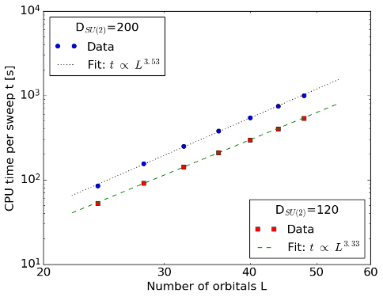

.. CheMPS2: a spin-adapted implementation of DMRG for ab initio quantum chemistry
   Copyright (C) 2013-2018 Sebastian Wouters

   This program is free software; you can redistribute it and/or modify
   it under the terms of the GNU General Public License as published by
   the Free Software Foundation; either version 2 of the License, or
   (at your option) any later version.

   This program is distributed in the hope that it will be useful,
   but WITHOUT ANY WARRANTY; without even the implied warranty of
   MERCHANTABILITY or FITNESS FOR A PARTICULAR PURPOSE.  See the
   GNU General Public License for more details.

   You should have received a copy of the GNU General Public License along
   with this program; if not, write to the Free Software Foundation, Inc.,
   51 Franklin Street, Fifth Floor, Boston, MA 02110-1301 USA.

.. index:: Computer resources
.. index:: Wall time
.. index:: Memory
.. index:: Disk

Typical resource requirements
=============================

In this section, typical resource requirements for DMRG calculations are discussed. With :math:`L` spatial orbitals and :math:`D` virtual basis states, the algorithm has a theoretical scaling per sweep of

* :math:`\mathcal{O}(L^4D^2 + L^3D^3)` in CPU time
* :math:`\mathcal{O}(L^2D^2)` in memory
* :math:`\mathcal{O}(L^3D^2)` in disk

The block-sparsity and information compression due to the exploitation of symmetry have not been taken into account in these scalings!

Scaling with system size
------------------------

Ref. [TIMING1]_ contains CPU time measurements for polyenes of increasing length, and demonstrates the scaling of CheMPS2 with :math:`L`. The geometries of all-trans polyenes :math:`\text{C}_n\text{H}_{n+2}` were optimized at the B3LYP/6-31G** level of theory for :math:`n=12`, 14, 16, 18, 20, 22 and 24. The :math:`\sigma`-orbitals were kept frozen at the RHF/6-31G level of theory. The :math:`\pi`-orbitals in the 6-31G basis were localized by means of the Edmiston-Ruedenberg localization procedure. The localized :math:`\pi`-orbitals belong to the :math:`\mathsf{A''}` irrep of the :math:`\mathsf{C_s}` point group, and were ordered according to the one-dimensional topology of the polyene. For all polyenes, the average CPU time per DMRG sweep (in seconds) was determined with snapshot `d520e9e5af1c16621537f2bb51f3ae6f398c3ab8 <https://github.com/SebWouters/CheMPS2/commit/d520e9e5af1c16621537f2bb51f3ae6f398c3ab8>`_ from the `CheMPS2 github repository <https://github.com/sebwouters/chemps2>`_ on a single Intel Xeon Sandy Bridge (E5-2670) core @ 2.6 GHz. For the two values of :math:`D` shown in the figure, the energies are converged to :math:`\mu E_h` accuracy due to the one-dimensional topology of the localized and ordered :math:`\pi`-orbitals. Due to the imposed :math:`\mathsf{SU(2)} \otimes \mathsf{U(1)} \otimes \mathsf{C_s}` symmetry, all tensors become block-sparse, which causes the scaling to be below :math:`\mathcal{O}(L^4)`.

N2/cc-pVDZ
----------

The nitrogen dimer in the cc-pVDZ basis has an active space of 14 electrons in 28 orbitals. The exploited point group in the calculations was :math:`\mathsf{D_{2h}}`, and the targeted state was :math:`\mathsf{X^1\Sigma_g^+}` at equilibrium bond length: 2.118 a.u. This system was first studied with DMRG in Ref. [NITROGEN]_. The listed CheMPS2 timings are wall times per sweep (in seconds) on 16 Intel Xeon Sandy Bridge (E5-2670) cores @ 2.6 GHz. The calculation was performed with snapshot `045393b439821c81d800328c0b4b8b1732da47f8 <https://github.com/SebWouters/CheMPS2/commit/045393b439821c81d800328c0b4b8b1732da47f8>`_ from the `CheMPS2 github repository <https://github.com/sebwouters/chemps2>`_. The orbitals were reordered with ``void CheMPS2::Problem::SetupReorderD2h()``. The residual norm tolerance for the Davidson algorithm was set to :math:`10^{-5}`. OpenMP parallelization on a single node was used, and the calculation needed ~ 6 Gb of memory.

 +----------------------------+-------------------------+--------------------+-----------------------+
 | :math:`D_{\mathsf{SU(2)}}` | Wall time per sweep (s) | :math:`w_D^{disc}` | :math:`E_D` (Hartree) |
 +============================+=========================+====================+=======================+
 | 1000                       | 48                      | 9.8027e-07         | -109.28209711         |
 +----------------------------+-------------------------+--------------------+-----------------------+
 | 1500                       | 113                     | 3.9381e-07         | -109.28214593         |
 +----------------------------+-------------------------+--------------------+-----------------------+
 | 2000                       | 219                     | 1.8910e-07         | -109.28216077         |
 +----------------------------+-------------------------+--------------------+-----------------------+
 | 2500                       | 371                     | 1.0083e-07         | -109.28216667         |
 +----------------------------+-------------------------+--------------------+-----------------------+

.. _label-water-roos-ano-dz:

H2O/Roos' ANO DZ
----------------

Water in Roos' ANO DZ basis has an active space of 10 electrons in 41 orbitals. The exploited point group in the calculations was :math:`\mathsf{C_{2v}}`, and the targeted state was :math:`\mathsf{^1A_1}` at equilibrium geometry: O @ (0, 0, 0) and H @ (± 0.790689766, 0, 0.612217330) Angstrom. This system was first studied with DMRG in Ref. [WATER]_. The listed CheMPS2 timings are wall times per sweep (in seconds) on 20 Intel Xeon Ivy Bridge (E5-2670 v2) cores @ 2.5 GHz. The calculation was performed with snapshot `045393b439821c81d800328c0b4b8b1732da47f8 <https://github.com/SebWouters/CheMPS2/commit/045393b439821c81d800328c0b4b8b1732da47f8>`_ from the `CheMPS2 github repository <https://github.com/sebwouters/chemps2>`_. The residual norm tolerance for the Davidson algorithm was set to :math:`10^{-5}`. OpenMP parallelization on a single node was used, and the calculation needed ~ 64 Gb of memory.

 +----------------------------+-------------------------+--------------------+-----------------------+
 | :math:`D_{\mathsf{SU(2)}}` | Wall time per sweep (s) | :math:`w_D^{disc}` | :math:`E_D` (Hartree) |
 +============================+=========================+====================+=======================+
 | 1000                       | 401                     | 8.7950e-08         | -76.31468302          |
 +----------------------------+-------------------------+--------------------+-----------------------+
 | 2000                       | 2111                    | 1.1366e-08         | -76.31471044          |
 +----------------------------+-------------------------+--------------------+-----------------------+
 | 3000                       | 5686                    | 2.9114e-09         | -76.31471342          |
 +----------------------------+-------------------------+--------------------+-----------------------+
 | 4000                       | 10958                   | 6.8011e-10         | -76.31471402          |
 +----------------------------+-------------------------+--------------------+-----------------------+

Hybrid parallelization
----------------------

CheMPS2 contains a hybrid MPI and OpenMP parallelization for mixed distributed and shared memory architectures. In Ref. [TIMING2]_ this hybrid parallelization is illustrated for H2O in Roos' ANO DZ basis, the system studied :ref:`above <label-water-roos-ano-dz>`. The speedups achieved with snapshot `045393b439821c81d800328c0b4b8b1732da47f8 <https://github.com/SebWouters/CheMPS2/commit/045393b439821c81d800328c0b4b8b1732da47f8>`_ of the `CheMPS2 github repository <https://github.com/sebwouters/chemps2>`_ and `Block version 1.1-alpha <https://github.com/sanshar/block/releases/tag/v1.1-alpha>`_ are shown in the figures below. All calculations were performed with reduced virtual dimension :math:`D=1000`. RHF orbitals were used, ordered per irreducible representation of :math:`\mathsf{C_{2v}}` according to their single-particle energy, and the irreducible representations were ordered as :math:`\{ \mathsf{A1},~\mathsf{A2},~\mathsf{B1},~\text{and}~\mathsf{B2} \}`. The residual norm tolerance for the Davidson algorithm was set to :math:`10^{-4}`. Note that in Block the square of this parameter needs to be passed. Each node has a dual Intel Xeon Sandy Bridge E5-2670 (total of 16 cores at 2.6 GHz) and 64 GB of memory. The nodes are connected with FDR InfiniBand. The renormalized operators were stored on GPFS in order to achieve high disk bandwidths. Both codes and all depending libraries were compiled with the Intel MPI compiler version 2015.1.133. The Intel Math Kernel Library version 11.2.1.133 was used for BLAS and LAPACK routines.

.. image:: single_node_h2o.png

Figure above: Comparison of pure MPI and OpenMP speedups on a single node. Wall times per sweep are indicated for 16 cores (in seconds).

.. image:: multi_node_h2o.png

Figure above: Illustration of the hybrid parallelization of CheMPS2. For 16 cores and less, one MPI process with several OpenMP threads is used. For 32 cores and more, several MPI processes each with 16 OpenMP threads are used. Wall times per sweep are indicated (in seconds).

.. [TIMING1] S. Wouters and D. Van Neck, *European Physical Journal D* **68**, 272 (2014), doi: `10.1140/epjd/e2014-50500-1 <http://dx.doi.org/10.1140/epjd/e2014-50500-1>`_
.. [TIMING2] S. Wouters, V. Van Speybroeck and D. Van Neck, *Journal of Chemical Physics* **145**, 054120 (2016), doi: `10.1063/1.4959817 <http://dx.doi.org/10.1063/1.4959817>`_
.. [NITROGEN] G.K.-L. Chan, M. Kallay and J. Gauss, *Journal of Chemical Physics* **121**, 6110 (2004), doi: `10.1063/1.1783212 <http://dx.doi.org/10.1063/1.1783212>`_
.. [WATER] G. K.-L. Chan and M. Head-Gordon, *Journal of Chemical Physics* **118**, 8551 (2003), doi: `10.1063/1.1574318 <http://dx.doi.org/10.1063/1.1574318>`_

